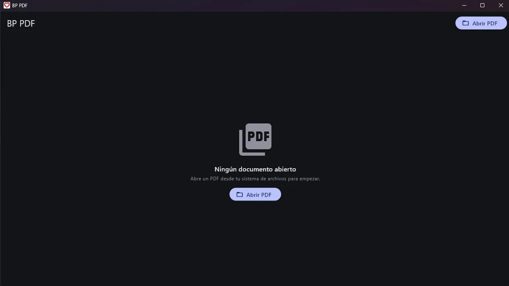
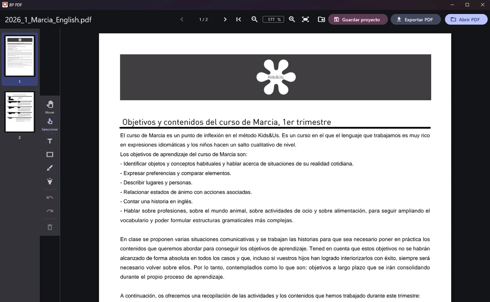
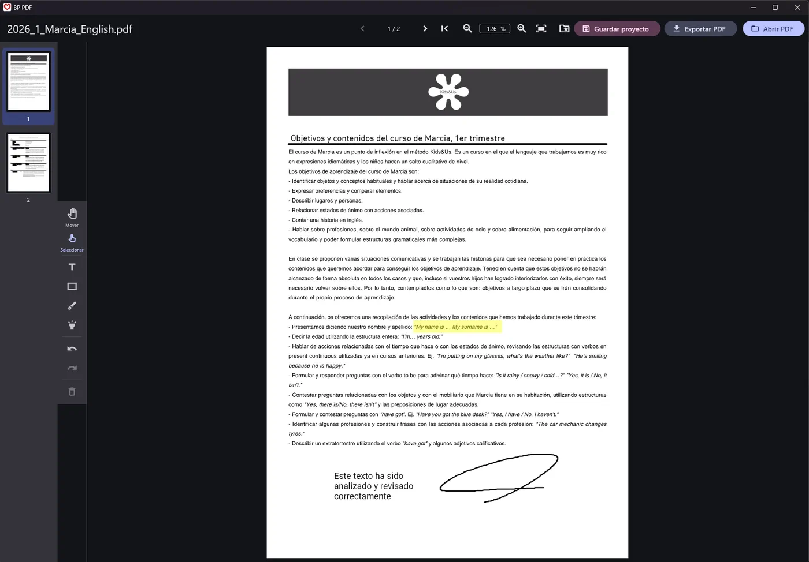

# BP PDF

[](https://github.com/bpstack/bp_pdf/actions/workflows/ci.yml)

A local-first PDF annotation editor built with Flutter. Everything runs on your device — no server, no accounts, no internet required.

## Screenshots

Clean start screen — open any PDF from your file system:



Viewer with zoom, page navigation and a thumbnail sidebar:



Annotating a document — text, highlight and freehand drawing layered on top, original file untouched:



## What it does

- **Open PDFs** from your file system and navigate them with zoom and a thumbnail sidebar
- **Add text** on top of any page — pick font family, size, and color; move or delete annotations freely
- **Whiteout ("tipp-ex")** — cover original content with an opaque rectangle, then write over it
- **Freehand drawing** — sketch directly on the page
- **Highlight areas** with a translucent color overlay
- **Undo / redo** across the full annotation history
- **Export to a new PDF** — original file is never modified; annotations are rasterized and embedded with your chosen fonts
- **Save and reopen sessions** — your editing session (PDF copy + annotations) is stored locally so you can continue later
- **Light and dark theme**, responsive layout (desktop sidebar panel / mobile bottom sheet)

## Tech stack

| Layer | Technology |
|---|---|
| Framework | Flutter 3.44+ / Dart 3.12+ |
| State management | Riverpod 3.x |
| PDF rendering | pdfrx 2.x (pdfium via FFI) |
| PDF export | pdf 3.x + printing 5.x |
| Immutable models | freezed 3.x |
| File picking | file_selector (official Flutter plugin) |
| Fonts embedded in export | Roboto, Open Sans, Lato, Merriweather, Source Code Pro (OFL / Apache-2.0) |

Architecture: Clean Architecture feature-first in three layers (`domain` / `data` / `presentation`). The domain layer has zero Flutter or third-party imports.

## Platforms

| Platform | Status |
|---|---|
| Windows | ✅ **Stable** — built and tested |
| Android | ✅ **Stable** — built and tested on device (incl. saving projects opened via the Android file picker / SAF) |
| Linux | ✅ **Stable** — built and tested on Ubuntu (GTK window, pdfrx/pdfium rendering, full open → annotate → save → reopen flow) |
| iOS / macOS / Web | Out of scope |

## Getting started

### Prerequisites

- Flutter stable ≥ 3.44 with Dart ≥ 3.12. The exact version this project is
  developed and tested against is pinned in [`.tool-versions`](.tool-versions)
  (`flutter 3.44.1-stable`); if you use [asdf](https://asdf-vm.com) it will pick
  it up automatically (`asdf install`).
- **Windows:** Visual Studio Build Tools 2022 with the *"Desktop development with C++"* workload + Windows Developer Mode enabled (required by pdfrx Native Assets)
- **Android:** Android Studio / SDK, accepted licenses (`flutter doctor --android-licenses`)
- **Linux:** `clang cmake ninja-build pkg-config libgtk-3-dev`

Verify your setup:

```bash
flutter doctor
```

### Run in development

```powershell
# Windows
flutter run -d windows

# Android (device or emulator connected)
flutter run -d <device-id>

# Linux
flutter run -d linux
```

### Build release

```powershell
# Windows
flutter build windows --release
# Output: build\windows\x64\runner\Release\

# Android APK
flutter build apk --release

# Android App Bundle
flutter build appbundle --release

# Linux
flutter build linux --release
```

### After editing domain entities

```bash
dart run build_runner build --delete-conflicting-outputs
```

## Design principles

- **Local-first:** PDFs never leave your device
- **Original untouched:** export always creates a new file
- **No accounts, no tracking, no ads, no subscriptions**
- **100% offline**
- **Open-source dependencies only** (MIT / BSD / Apache-2.0)

## License

This project is released under the **MIT License** — see [`LICENSE`](LICENSE).

All runtime dependencies are MIT, BSD-3, or Apache-2.0. Font assets are OFL-1.1 or Apache-2.0 and may be embedded and redistributed.
